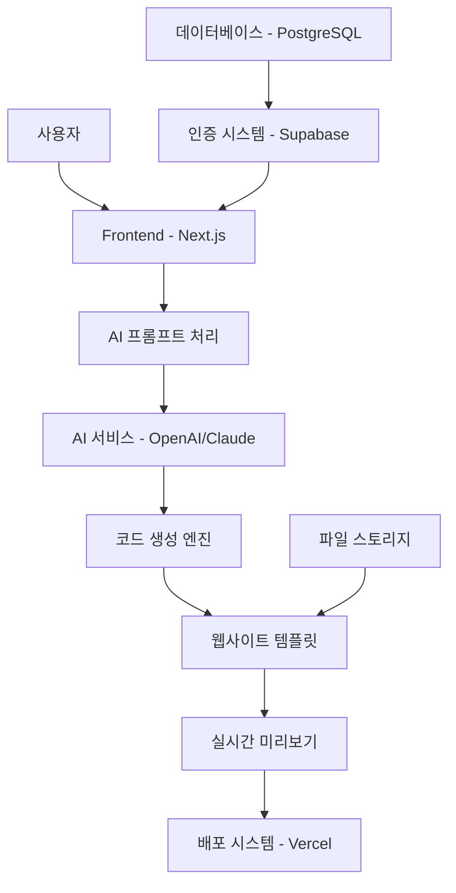
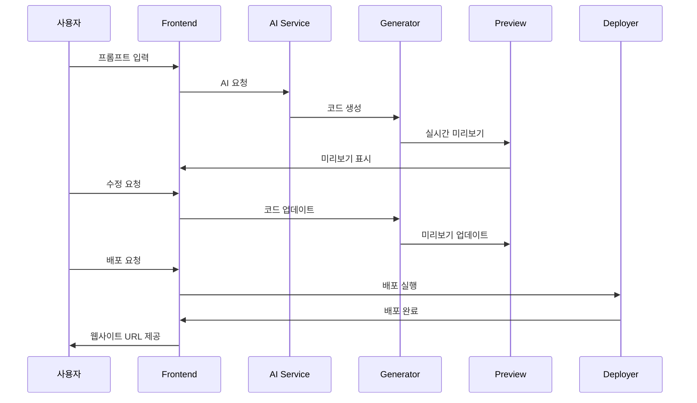

# 🤖 AI 웹사이트 빌더 아키텍처

## 📋 개요

Code King Builder는 AI 프롬프트를 기반으로 사용자가 자연어로 웹사이트를 생성할 수 있는 혁신적인 플랫폼입니다. 이 문서는 전체 시스템의 기술적 아키텍처와 구현 방식을 상세히 설명합니다.

## 🏗️ 전체 시스템 아키텍처



## 🎯 핵심 컴포넌트

### 1. **Frontend Layer (Next.js 15)**

#### **기술 스택**

- **Framework**: Next.js 15 (App Router)
- **Language**: TypeScript
- **Styling**: Tailwind CSS
- **State Management**: React Context API
- **Animations**: Framer Motion
- **Forms**: React Hook Form

#### **주요 페이지 구조**

```
src/app/[locale]/
├── page.tsx                 # 홈페이지
├── builder/
│   ├── page.tsx            # 빌더 메인 페이지
│   └── editor/
│       └── page.tsx        # AI 에디터
├── templates/
│   └── page.tsx            # 템플릿 갤러리
├── portfolio/
│   └── page.tsx            # 포트폴리오
└── profile/[userId]/
    └── page.tsx            # 사용자 프로필
```

### 2. **AI 프롬프트 처리 시스템**

#### **프롬프트 엔지니어링**

```typescript
interface PromptTemplate {
  system: string; // AI 역할 정의
  user: string; // 사용자 입력
  context: string; // 컨텍스트 정보
  constraints: string[]; // 제약사항
}
```

#### **프롬프트 구조**

```typescript
const systemPrompt = `
당신은 전문적인 웹 개발자입니다.
다음 요구사항에 따라 완전한 웹사이트 코드를 생성해주세요:

1. HTML5 시맨틱 마크업 사용
2. Tailwind CSS 클래스 활용
3. 반응형 디자인 적용
4. 접근성 고려
5. SEO 최적화

생성된 코드는 즉시 실행 가능해야 합니다.
`;

const userPrompt = `
웹사이트 요구사항:
- 목적: ${purpose}
- 스타일: ${style}
- 기능: ${features}
- 색상: ${colors}
- 콘텐츠: ${content}
`;
```

### 3. **AI 서비스 통합**

#### **OpenAI GPT-4 통합**

```typescript
// src/lib/ai/openai.ts
import OpenAI from "openai";

const openai = new OpenAI({
  apiKey: process.env.OPENAI_API_KEY,
});

export async function generateWebsite(prompt: string) {
  const completion = await openai.chat.completions.create({
    model: "gpt-4-turbo-preview",
    messages: [
      { role: "system", content: systemPrompt },
      { role: "user", content: prompt },
    ],
    temperature: 0.7,
    max_tokens: 4000,
  });

  return completion.choices[0].message.content;
}
```

#### **Claude Sonnet 통합 (대안)**

```typescript
// src/lib/ai/claude.ts
import Anthropic from "@anthropic-ai/sdk";

const anthropic = new Anthropic({
  apiKey: process.env.ANTHROPIC_API_KEY,
});

export async function generateWithClaude(prompt: string) {
  const message = await anthropic.messages.create({
    model: "claude-3-sonnet-20240229",
    max_tokens: 4000,
    messages: [{ role: "user", content: prompt }],
  });

  return message.content[0].text;
}
```

### 4. **코드 생성 엔진**

#### **템플릿 시스템**

```typescript
// src/lib/templates/index.ts
interface Template {
  id: string;
  name: string;
  category: string;
  preview: string;
  code: string;
  variables: TemplateVariable[];
}

interface TemplateVariable {
  name: string;
  type: "string" | "number" | "boolean" | "array";
  defaultValue: any;
  description: string;
}
```

#### **코드 생성 파이프라인**

```typescript
// src/lib/generator/index.ts
export class CodeGenerator {
  async generateWebsite(prompt: string): Promise<GeneratedWebsite> {
    // 1. 프롬프트 분석
    const analysis = await this.analyzePrompt(prompt);

    // 2. 템플릿 선택
    const template = await this.selectTemplate(analysis);

    // 3. AI 코드 생성
    const aiCode = await this.generateAICode(prompt, template);

    // 4. 코드 검증
    const validatedCode = await this.validateCode(aiCode);

    // 5. 최적화
    const optimizedCode = await this.optimizeCode(validatedCode);

    return {
      html: optimizedCode.html,
      css: optimizedCode.css,
      js: optimizedCode.js,
      metadata: analysis,
    };
  }
}
```

### 5. **실시간 미리보기 시스템**

#### **Live Preview Engine**

```typescript
// src/lib/preview/index.ts
export class LivePreview {
  private iframe: HTMLIFrameElement;
  private debounceTimer: NodeJS.Timeout;

  constructor(container: HTMLElement) {
    this.iframe = document.createElement("iframe");
    this.setupIframe();
  }

  updatePreview(code: GeneratedWebsite) {
    clearTimeout(this.debounceTimer);
    this.debounceTimer = setTimeout(() => {
      this.renderCode(code);
    }, 300);
  }

  private renderCode(code: GeneratedWebsite) {
    const html = `
      <!DOCTYPE html>
      <html>
        <head>
          <meta charset="UTF-8">
          <meta name="viewport" content="width=device-width, initial-scale=1.0">
          <script src="https://cdn.tailwindcss.com"></script>
          <style>${code.css}</style>
        </head>
        <body>
          ${code.html}
          <script>${code.js}</script>
        </body>
      </html>
    `;

    this.iframe.srcdoc = html;
  }
}
```

### 6. **배포 시스템 (Vercel)**

#### **자동 배포 파이프라인**

```typescript
// src/lib/deploy/vercel.ts
export class VercelDeployer {
  async deployWebsite(website: GeneratedWebsite, userId: string) {
    // 1. 프로젝트 생성
    const project = await this.createProject(userId);

    // 2. 파일 업로드
    const files = this.prepareFiles(website);
    await this.uploadFiles(project.id, files);

    // 3. 배포 실행
    const deployment = await this.deploy(project.id);

    // 4. 도메인 설정
    const domain = await this.setupDomain(deployment);

    return {
      url: domain,
      deploymentId: deployment.id,
      status: deployment.status,
    };
  }

  private prepareFiles(website: GeneratedWebsite) {
    return [
      { name: "index.html", content: website.html },
      { name: "styles.css", content: website.css },
      { name: "script.js", content: website.js },
      { name: "vercel.json", content: this.getVercelConfig() },
    ];
  }
}
```

## 🔐 인증 및 보안

### **Supabase 인증 시스템**

```typescript
// src/lib/supabase/auth.ts
export const auth = {
  signIn: async (credentials: SignInData) => {
    const { data, error } = await supabase.auth.signInWithPassword(credentials);
    return { data, error };
  },

  signUp: async (userData: SignupData) => {
    const { data, error } = await supabase.auth.signUp({
      email: userData.email,
      password: userData.password,
      options: {
        data: {
          name: userData.name,
          phone: userData.phone,
        },
      },
    });
    return { data, error };
  },
};
```

### **API 보안**

```typescript
// src/app/api/ai/generate/route.ts
export async function POST(request: Request) {
  // 1. 인증 확인
  const user = await getCurrentUser();
  if (!user) {
    return NextResponse.json({ error: "Unauthorized" }, { status: 401 });
  }

  // 2. 요청 제한 확인
  const rateLimit = await checkRateLimit(user.id);
  if (!rateLimit.allowed) {
    return NextResponse.json({ error: "Rate limit exceeded" }, { status: 429 });
  }

  // 3. 프롬프트 검증
  const { prompt } = await request.json();
  const validatedPrompt = await validatePrompt(prompt);

  // 4. AI 생성 실행
  const result = await generateWebsite(validatedPrompt);

  // 5. 사용량 기록
  await recordUsage(user.id, "ai_generation");

  return NextResponse.json(result);
}
```

## 📊 데이터베이스 스키마

### **PostgreSQL 테이블 구조**

```sql
-- 사용자 테이블
CREATE TABLE users (
  id UUID PRIMARY KEY DEFAULT gen_random_uuid(),
  email VARCHAR(255) UNIQUE NOT NULL,
  name VARCHAR(255),
  phone VARCHAR(20),
  created_at TIMESTAMP DEFAULT NOW(),
  updated_at TIMESTAMP DEFAULT NOW()
);

-- 웹사이트 프로젝트 테이블
CREATE TABLE projects (
  id UUID PRIMARY KEY DEFAULT gen_random_uuid(),
  user_id UUID REFERENCES users(id),
  name VARCHAR(255) NOT NULL,
  description TEXT,
  html_content TEXT,
  css_content TEXT,
  js_content TEXT,
  metadata JSONB,
  deployed_url VARCHAR(500),
  status VARCHAR(50) DEFAULT 'draft',
  created_at TIMESTAMP DEFAULT NOW(),
  updated_at TIMESTAMP DEFAULT NOW()
);

-- AI 생성 히스토리 테이블
CREATE TABLE ai_generations (
  id UUID PRIMARY KEY DEFAULT gen_random_uuid(),
  user_id UUID REFERENCES users(id),
  project_id UUID REFERENCES projects(id),
  prompt TEXT NOT NULL,
  generated_code TEXT,
  tokens_used INTEGER,
  cost DECIMAL(10,4),
  created_at TIMESTAMP DEFAULT NOW()
);

-- 사용량 제한 테이블
CREATE TABLE usage_limits (
  id UUID PRIMARY KEY DEFAULT gen_random_uuid(),
  user_id UUID REFERENCES users(id),
  plan_type VARCHAR(50) DEFAULT 'free',
  daily_generations INTEGER DEFAULT 5,
  monthly_generations INTEGER DEFAULT 100,
  current_daily_count INTEGER DEFAULT 0,
  current_monthly_count INTEGER DEFAULT 0,
  reset_date DATE DEFAULT CURRENT_DATE,
  created_at TIMESTAMP DEFAULT NOW(),
  updated_at TIMESTAMP DEFAULT NOW()
);
```

## 🚀 성능 최적화

### **1. 프롬프트 캐싱**

```typescript
// src/lib/cache/prompt-cache.ts
export class PromptCache {
  private cache = new Map<string, CachedResult>();

  async getCachedResult(prompt: string): Promise<CachedResult | null> {
    const hash = this.hashPrompt(prompt);
    const cached = this.cache.get(hash);

    if (cached && Date.now() - cached.timestamp < 24 * 60 * 60 * 1000) {
      return cached;
    }

    return null;
  }

  async cacheResult(prompt: string, result: GeneratedWebsite) {
    const hash = this.hashPrompt(prompt);
    this.cache.set(hash, {
      result,
      timestamp: Date.now(),
    });
  }
}
```

### **2. 코드 최적화**

```typescript
// src/lib/optimizer/index.ts
export class CodeOptimizer {
  async optimizeHTML(html: string): Promise<string> {
    // 1. 불필요한 공백 제거
    html = html.replace(/\s+/g, " ").trim();

    // 2. 중복 클래스 제거
    html = this.removeDuplicateClasses(html);

    // 3. 시맨틱 태그 최적화
    html = this.optimizeSemanticTags(html);

    return html;
  }

  async optimizeCSS(css: string): Promise<string> {
    // 1. 사용하지 않는 CSS 제거
    css = await this.removeUnusedCSS(css);

    // 2. CSS 압축
    css = this.minifyCSS(css);

    // 3. Critical CSS 추출
    const criticalCSS = await this.extractCriticalCSS(css);

    return { css, criticalCSS };
  }
}
```

### **3. 이미지 최적화**

```typescript
// src/lib/optimizer/image-optimizer.ts
export class ImageOptimizer {
  async optimizeImages(html: string): Promise<string> {
    // 1. 이미지 태그 찾기
    const imageTags = this.extractImageTags(html);

    // 2. 각 이미지 최적화
    for (const tag of imageTags) {
      const optimizedTag = await this.optimizeImageTag(tag);
      html = html.replace(tag, optimizedTag);
    }

    return html;
  }

  private async optimizeImageTag(tag: string): Promise<string> {
    // WebP 변환, lazy loading, 적응형 이미지 적용
    return tag
      .replace(/\.(jpg|jpeg|png)/g, ".webp")
      .replace(/<img/g, '<img loading="lazy"')
      .replace(/src="/g, 'srcset="');
  }
}
```

## 🔄 워크플로우

### **1. 웹사이트 생성 프로세스**



### **2. 에러 처리 및 복구**

```typescript
// src/lib/error-handler/index.ts
export class ErrorHandler {
  async handleGenerationError(error: Error, context: GenerationContext) {
    // 1. 에러 로깅
    await this.logError(error, context);

    // 2. 사용자에게 친화적인 메시지 생성
    const userMessage = this.createUserFriendlyMessage(error);

    // 3. 대안 제시
    const alternatives = await this.suggestAlternatives(context);

    // 4. 재시도 로직
    if (this.shouldRetry(error)) {
      return await this.retryGeneration(context);
    }

    return { error: userMessage, alternatives };
  }
}
```

## 📈 모니터링 및 분석

### **1. 성능 모니터링**

```typescript
// src/lib/monitoring/performance.ts
export class PerformanceMonitor {
  async trackGenerationTime(startTime: number, endTime: number) {
    const duration = endTime - startTime;

    await this.recordMetric("generation_time", {
      duration,
      timestamp: new Date(),
      user_id: this.getCurrentUserId(),
    });
  }

  async trackTokenUsage(tokens: number, cost: number) {
    await this.recordMetric("token_usage", {
      tokens,
      cost,
      timestamp: new Date(),
    });
  }
}
```

### **2. 사용자 행동 분석**

```typescript
// src/lib/analytics/user-behavior.ts
export class UserBehaviorAnalytics {
  async trackUserJourney(userId: string, action: string, data: any) {
    await this.recordEvent({
      user_id: userId,
      event: action,
      data,
      timestamp: new Date(),
      session_id: this.getSessionId(),
    });
  }

  async generateInsights() {
    // 사용자 행동 패턴 분석
    const patterns = await this.analyzePatterns();

    // 개선 제안 생성
    const suggestions = await this.generateSuggestions(patterns);

    return { patterns, suggestions };
  }
}
```

## 🔮 향후 확장 계획

### **1. 고급 AI 기능**

- **멀티모달 AI**: 이미지, 음성, 텍스트 통합 처리
- **컨텍스트 인식**: 사용자 히스토리 기반 개인화
- **실시간 협업**: 다중 사용자 동시 편집

### **2. 플랫폼 확장**

- **모바일 앱**: React Native 기반 모바일 빌더
- **브라우저 확장**: Chrome/Firefox 확장 프로그램
- **API 서비스**: 외부 개발자용 REST API

### **3. 고급 기능**

- **E-commerce 통합**: 쇼핑몰 자동 생성
- **SEO 최적화**: 자동 SEO 분석 및 개선
- **성능 최적화**: 자동 성능 분석 및 최적화

## 📚 참고 자료

- [Next.js 15 Documentation](https://nextjs.org/docs)
- [OpenAI API Documentation](https://platform.openai.com/docs)
- [Supabase Documentation](https://supabase.com/docs)
- [Vercel Documentation](https://vercel.com/docs)
- [Tailwind CSS Documentation](https://tailwindcss.com/docs)

---

**마지막 업데이트**: 2025년 8월 29일
**버전**: 1.0.0
**작성자**: Code King Builder Team
