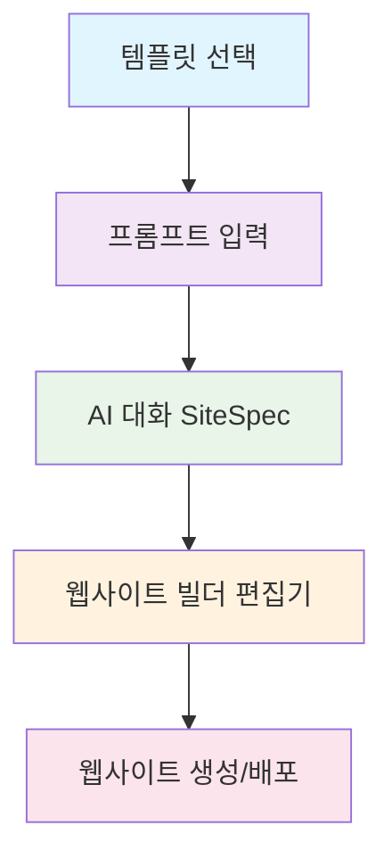

# 🚀 AI Website Builder Architecture

## Next.js + Supabase 기반 SaaS 빌더

---

## 📋 목차

- [개요](#-개요)
- [시스템 흐름](#-시스템-흐름)
- [단계별 구조](#-단계별-구조)
- [핵심 개념](#-핵심-개념)
- [기술 스택](#-기술-스택)
- [구현 세부사항](#-구현-세부사항)
- [AI 통합 아키텍처](#-ai-통합-아키텍처)
- [DSL 프롬프트 설계](#-dsl-프롬프트-설계)

---

## 🎯 개요

이 프로젝트는 사용자가 **템플릿을 선택**하고, **AI와 대화**하며 웹사이트를 점진적으로 설계/편집/생성할 수 **있는** **SaaS 빌더**입니다.

### 🔄 핵심 워크플로우

```
템플릿 선택 → 프롬프트 입력 → AI 대화 → 웹사이트 빌더 → 생성/배포
```

---

## 🔄 시스템 흐름



---

## 🏗️ 단계별 구조

### 1️⃣ **템플릿 선택**

**역할**: 사이트의 기본 레이아웃/구조 정의

**구현**:

- `templates` 테이블에 사전 정의된 템플릿 메타데이터 저장
- 템플릿별 "허용 섹션 타입" whitelist 포함 (Hero, Features, CTA, Pricing 등)

**Next.js 처리**:

- `/builder` 페이지에서 드롭다운/갤러리 UI 제공
- 선택한 템플릿 slug를 이후 AI 프롬프트와 함께 API로 전송

---

### 2️⃣ **프롬프트 입력**

**역할**: 사용자가 브랜드·목적·요구사항을 텍스트로 설명

**구현**:

- `/builder` UI에서 textarea 입력 → `/api/generate` POST
- 최소 길이, 금지어 필터링, 프롬프트 주입 방지 처리

**Next.js 처리**:

- Edge Route Handler (`app/api/generate/route.ts`)에서 JSON body 파싱
- AI 호출 준비

---

### 3️⃣ **AI 대화**

**역할**: 사용자의 설명을 기반으로 SiteSpec(JSON) 구조 생성

**AI 모델**:

- GPT-4.1, Claude 3.5 Sonnet 등 → **Planner 모델**
- 출력: `{ brand, pages[], sections[] }` 구조

**검증**:

- Zod 스키마로 SiteSpec validate
- 실패 시 JSON repair → 재시도

**저장**:

- Supabase `sites`, `pages`, `sections` 테이블에 매핑
- `generations` 테이블에 prompt & 모델 로그 기록

---

### 4️⃣ **웹사이트 빌더 (편집기)**

**역할**: 생성된 SiteSpec을 기반으로 UI 편집 지원

**구현**:

- `SectionRenderer`가 `kind` → 컴포넌트 레지스트리 매핑

**편집 UI**:

- props 인라인 수정 (예: 버튼 텍스트 변경)
- 섹션 추가/삭제
- "AI로 다듬기" 버튼 → 해당 섹션만 재프롬프트

**Next.js 처리**:

- `/builder/[siteId]`에서 실시간 미리보기
- Supabase Realtime으로 props 변경사항 즉시 반영

**장점**:

- AI 생성 + 수동 편집이 공존하는 하이브리드 워크플로우

---

### 5️⃣ **웹사이트 생성 / 배포**

**미리보기**:

- 동적 라우팅 `/[site]/[...slug]`
- Supabase에서 섹션 JSON 불러와 컴포넌트 렌더

**배포**:

- 사이트 `status=published` → 도메인 연결
- 멀티테넌시 미들웨어 (호스트 기반 라우팅)
- Vercel/Netlify/Docker CI 연동

**이미지/에셋 처리** (옵션):

- AI가 image prompt 제안 → Supabase Storage에 업로드
- 섹션 props에 asset URL 자동 패치

---

## 💡 핵심 아이디어

> **LLM은 코드 대신 `구조화된 JSON(SiteSpec)`만 생성**  
> **프런트는 컴포넌트 레지스트리로 `JSON → UI`를 안전하게 매핑**  
> **재생성/부분수정은 `JSON diff`를 기반으로 섹션 단위 재생성**

---

## 🛠️ 기술 스택

| 영역         | 기술                                         |
| ------------ | -------------------------------------------- |
| **Frontend** | Next.js 15 + React 19 + TailwindCSS          |
| **Backend**  | Supabase (Postgres, Auth, Storage, Realtime) |
| **AI Layer** | OpenAI GPT-4.1 / Anthropic Claude 3.5        |
| **Infra**    | Vercel + Docker + GitHub Actions             |

---

## 🔑 핵심 개념

### SiteSpec 개념 및 검증

**SiteSpec**은 웹사이트 페이지의 구조화된 JSON 문서입니다.

**계층 구조**:

```
템플릿 → 페이지 → 섹션/컴포넌트 → props
```

**핵심 특징**:

- ✅ **템플릿 안정성 보장**: 레이아웃이 깨지지 않고, props만 안전하게 바뀜
- ✅ **AI 영향 범위 제한**: 허용된 필드만 수정 가능
- ✅ **자동 검증**: AJV(JSON Schema Validator)로 SiteSpec validate → 스키마 위반 시 reject
- ✅ **Undo/Redo & 버저닝**: DB(`generations` 테이블)에 모든 SiteSpec 저장 → 롤백 가능
- ✅ **부분적 재생성 가능**: 특정 섹션(props)만 다시 AI로 생성

#### 📝 예시 SiteSpec 스키마

```json
{
  "templateSlug": "startup",
  "brand": {
    "name": "Acme",
    "palette": [{ "name": "navy", "value": "#0a2540" }]
  },
  "pages": [
    {
      "slug": "index",
      "sections": [
        {
          "id": "sec_hero_01",
          "kind": "hero",
          "props": {
            "title": "Acme로 더 빠르게",
            "subtitle": "AI로 웹사이트 제작",
            "cta": { "label": "시작하기", "href": "/signup" }
          }
        }
      ]
    }
  ]
}
```

---

## 🎨 빌더 편집을 위한 MetaSpec 설계

### 큰 그림: 두 겹 구조

- **SiteSpec(JSON)**: 콘텐츠/구성의 "현재 상태" (템플릿 → 페이지 → 섹션/컴포넌트 → props)
- **MetaSpec(JSON)**: 빌더가 어떻게 편집하고 반응형/스타일/제약을 적용할지에 대한 "설명서"

빌더는 **SiteSpec + MetaSpec** → 편집 UI/미리보기/패치 DSL로 동작하고,  
저장은 항상 **SiteSpec(상태)**, **MetaSpec(스키마/설명서)**로 분리해 안전성 확보.

---

### MetaSpec 구성요소

#### A. 📝 EditSchema (폼 & 위젯)

각 컴포넌트의 편집 가능한 필드/타입/위젯/검증을 정의 (AJV 기준)

**역할**: "어떤 걸 수정할 수 있는지"를 명시 → 빌더가 자동 폼 생성

```json
// /templates/startup/components/hero/meta.edit.json
{
  "$id": "cmp.hero.edit",
  "type": "object",
  "properties": {
    "eyebrow": { "type": "string", "title": "Eyebrow" },
    "title": { "type": "string", "title": "Headline", "minLength": 3 },
    "subtitle": { "type": "string", "title": "Subheadline" },
    "cta": {
      "type": "object",
      "properties": {
        "label": { "type": "string", "title": "CTA Label" },
        "href": {
          "type": "string",
          "format": "uri-reference",
          "title": "CTA Link"
        }
      },
      "required": ["label"]
    }
  },
  "required": ["title", "cta"]
}
```

> **빌더는 이걸 읽어 폼 UI 자동 생성 + AJV validate로 즉시 반영**

---

#### B. 🎯 LayoutSpec (레이아웃/제약/그리드/오토 레이아웃)

피그마의 Auto Layout/제약을 웹에 맞게 단순화해 정의

**역할**: "섹션 안의 내부 배치 규칙"과 "반응형일 때의 수축/확장"을 선언

```json
// /templates/startup/components/hero/meta.layout.json
{
  "display": "grid",
  "grid": { "columns": 12, "gap": 24, "maxWidth": 1200, "align": "center" },
  "areas": [
    { "id": "copy", "col": { "start": 2, "span": 6 } },
    { "id": "visual", "col": { "start": 8, "span": 4 } }
  ],
  "constraints": {
    "copy": { "shrink": true, "wrap": true, "minWidth": 280 },
    "visual": { "aspectRatio": 1.2 }
  }
}
```

> **렌더러는 areas를 기준으로 내부 블록을 배치**  
> **빌더에서 드래그/순서 변경 시 허용된 영역 내에서만 재배치**

---

#### C. 📱 ResponsiveSpec (브레이크포인트 & 오버라이드)

기본 값 + breakpoint별 오버라이드

**특징**: 오버라이드는 SiteSpec에 "overlay"로 저장 → 컴포넌트 props는 캐스케이딩 머지

```json
// /templates/startup/meta.responsive.json
{
  "breakpoints": {
    "sm": 0,
    "md": 768,
    "lg": 1024
  },
  "overridableProps": [
    "typography.size",
    "spacing",
    "layout.areas",
    "image.src"
  ]
}
```

**SiteSpec에 저장되는 실제 오버레이 예**:

```json
{
  "sections": [
    {
      "id": "sec_hero_01",
      "kind": "hero",
      "props": {
        "title": "Acme로 더 빠르게",
        "visual": { "src": "/hero.png" }
      },
      "overrides": {
        "sm": { "visual": { "hidden": true } },
        "lg": { "typography": { "size": "xl" } }
      }
    }
  ]
}
```

---

#### D. 🎨 DesignTokens (토큰 기반 스타일)

컬러/타이포/스페이싱/라운드/쉐도우 등 토큰화

**장점**: 테마 스위치/브랜딩 적용/다국어 폰트 교체를 안정적으로 수행

```json
// /templates/shared/meta.tokens.json
{
  "colors": {
    "primary": "#0a2540",
    "accent": "#00d4b5",
    "fg": "#111",
    "bg": "#fff"
  },
  "typography": { "heading": "Inter", "body": "Inter" },
  "radius": { "sm": 8, "md": 12, "lg": 16 }
}
```

> **빌더는 토큰 수정 → 전체 섹션에 전파** (CSS 변수/Tailwind config 연계)

---

#### E. 🔄 Variants & Slots (컴포넌트 변형/슬롯)

한 컴포넌트를 "Hero-Left/Right/Centered" 같은 variant로 변형

**특징**: 내/외부 블록을 꽂는 slot 제공 → 레이아웃을 크게 흔들지 않고도 자유도 확보

```json
// /templates/startup/components/hero/meta.variants.json
{
  "variants": ["left", "right", "centered"],
  "default": "left",
  "slots": ["eyebrow", "title", "subtitle", "cta", "visual"]
}
```

---

#### F. 🛡️ Capabilities & Guards (편집 가드)

AI/사용자가 바꿀 수 있는 영역 제한 (문구/이미지/정렬/색상 등)

**목적**: "레이아웃 구조는 고정, 속성만 수정"처럼 파괴 방지 가드

```json
// /templates/startup/components/hero/meta.capabilities.json
{
  "editable": ["eyebrow", "title", "subtitle", "cta.label", "visual.src"],
  "guard": {
    "forbidKindChange": true,
    "maxTitleLength": 120
  }
}
```

---

## 🔧 구현 세부사항

### 1. 편집 흐름 (Builder UX → 저장/검증 → 미리보기)

#### 📥 **1단계: 로드**

- 템플릿 선택 → **SiteSpec(상태)** + **MetaSpec(설명서)** 동시 로딩
- 빌더는 EditSchema로 폼 자동 생성, LayoutSpec/ResponsiveSpec로 캔버스 준비

#### ✏️ **2단계: 편집**

- 사용자는 폼/드래그/속성 패널로 수정
- AI 편집은 **명령형 DSL(JSON Patch/명령어)**로만 허용
- 반응형은 현재 BP에서만 델타 저장(overrides)

#### ✅ **3단계: 검증**

- 모든 변경은 즉시 AJV validate (컴포넌트 단위 + 페이지 단위)
- Capabilities/Guards 위반 시 거부

#### 💾 **4단계: 저장 & 이력**

- 변경 로그를 operations로 기록 (undo/redo)
- 스냅샷은 generations/버전으로 저장 (롤백 가능)

#### 👁️ **5단계: 미리보기 & 발행**

- 미리보기는 서버/클라이언트 렌더로 즉시 확인
- 발행 시 SiteSpec freeze + tokens로 안정적 빌드

---

### 2. 명령형 편집 DSL (안전한 패치)

#### ✅ **허용 명령**

- `update_props(sectionId, patch[])` (RFC 6902 JSON Patch)
- `override_props(sectionId, breakpoint, patch[])`
- `add_section(pageSlug, kind, afterSectionId?, initialProps?)`
- `remove_section(sectionId)`
- `reorder_section(pageSlug, sectionId, before|after targetId)`
- `swap_variant(sectionId, variant)`

---

## 🤖 AI 통합 아키텍처

### 클라이언트 → 서버 → Claude API 흐름

**보안 구조**:

- 🔒 **클라이언트**: 사용자 입력만 전송 (API 키 노출 없음)
- 🛡️ **서버**: Next.js Route Handler에서 Claude API 호출 및 응답 검증
- 📡 **스트리밍**: 실시간 응답으로 향상된 UX 제공

---

### 구현 예시 (App Router)

#### 📁 **API Route 구조**

```typescript
// app/api/ai/route.ts
import Anthropic from "@anthropic-ai/sdk";

export const runtime = "nodejs"; // 또는 "edge"
export async function POST(req: Request) {
  const { messages, system } = await req.json();

  const anthropic = new Anthropic({
    apiKey: process.env.NEXT_PUBLIC_ANTHROPIC_API_KEY!,
  });

  // Claude Messages API 호출
  const resp = await anthropic.messages.create({
    model: "claude-3-5-sonnet-20241022",
    max_tokens: 2048,
    system, // DSL 규칙 주입
    messages, // 대화 내역
    stream: true, // 스트리밍 응답
  });

  // 스트림을 Next.js Response로 변환
  const stream = await Anthropic.toReadableStream(resp);
  return new Response(stream, {
    headers: { "Content-Type": "text/event-stream" },
  });
}
```

#### 🔄 **클라이언트 사용법**

```typescript
// 클라이언트에서 스트리밍 호출
const response = await fetch("/api/ai", {
  method: "POST",
  headers: { "Content-Type": "application/json" },
  body: JSON.stringify({ messages, system }),
});

// 스트리밍 응답 처리
const reader = response.body?.getReader();
// ... 스트리밍 로직
```

---

## 🎯 DSL 프롬프트 설계

### AI를 DSL로만 동작시키는 시스템 규칙

**목표**: 명령형 DSL(JSON Patch)만 출력하도록 강제하여 안전한 편집 보장

---

### 시스템 프롬프트 예시

```bash
You are an API that edits a JSON document called `siteSpec`.

STRICT RULES:
- Output MUST be a JSON array of JSON Patch operations (RFC 6902)
- Allowed operations: add, remove, replace, move, copy, test
- No prose, no markdown, no additional keys
- Paths must use JSON Pointer notation
- If request is impossible/invalid, output empty array []

Schema reference: RFC 6902 JSON Patch
```

---

### 프롬프트 설계 원칙

#### ✅ **Anthropic 권장사항**

- 🎭 **역할 명확화**: API의 정확한 동작 정의
- 📋 **규칙 구체화**: 허용/금지 동작 명시
- 🔒 **출력 제한**: JSON Patch 형식만 허용
- 📚 **표준 참조**: RFC 6902 JSON Patch 명세 활용

#### 🛡️ **보안 고려사항**

- **입력 검증**: 사용자 프롬프트 필터링
- **출력 검증**: JSON Patch 스키마 검증
- **권한 제한**: 허용된 작업만 수행
- **로깅**: 모든 AI 요청/응답 기록

---

## 🎯 결론

**SiteSpec = 상태**, **MetaSpec = 편집 설명서**로 분리하면:

- ✅ **피그마급 조작 자유도**를 제공하면서도
- ✅ **템플릿 안정성**을 강하게 보장할 수 있습니다
- ✅ **반응형은 오버레이(override) 델타 모델**로 단순/예측 가능하게
- ✅ **모든 변경은 AJV 검증 + Capabilities 가드 + 명령형 DSL**로 안전하게 통제
- ✅ **AI 통합은 보안과 안정성을 모두 확보**하여 프로덕션 환경에서 안전하게 운영

---

## 📚 참고 자료

- [Next.js 15 Documentation](https://nextjs.org/docs)
- [Supabase Documentation](https://supabase.com/docs)
- [JSON Schema Validation](https://json-schema.org/)
- [RFC 6902 JSON Patch](https://tools.ietf.org/html/rfc6902)
- [Anthropic Claude API](https://docs.anthropic.com/)
- [JSON Pointer RFC 6901](https://tools.ietf.org/html/rfc6901)
