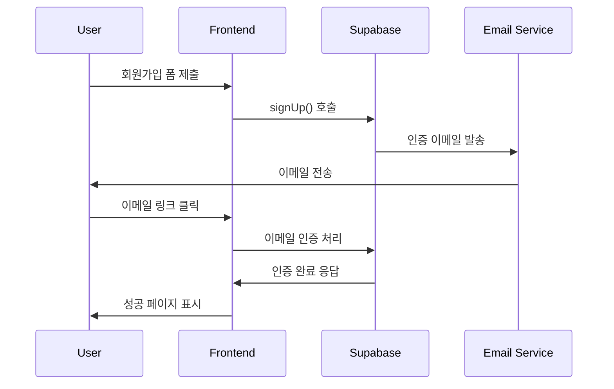
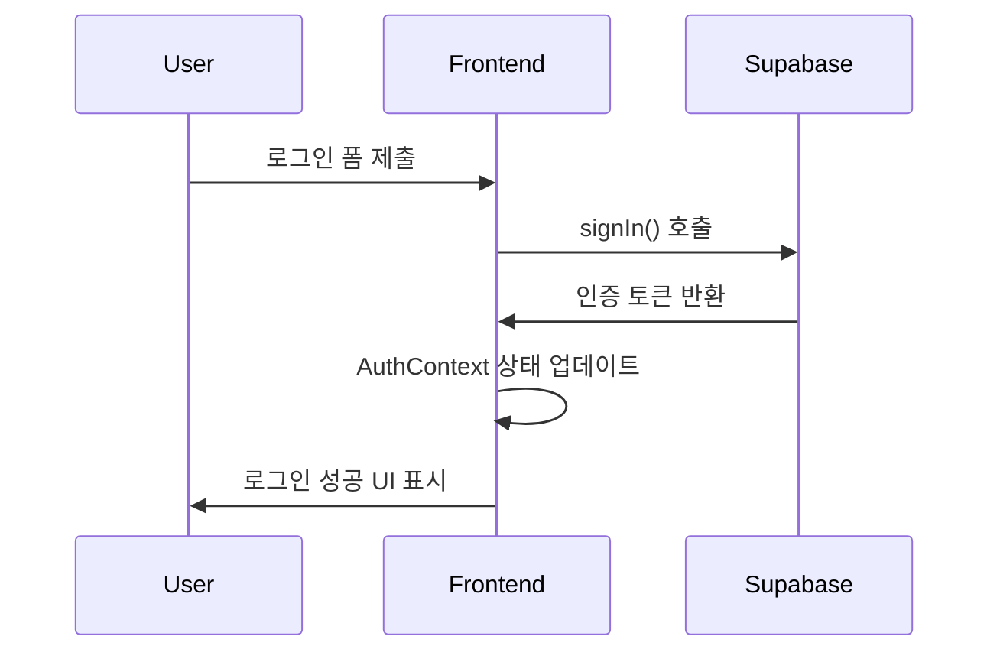
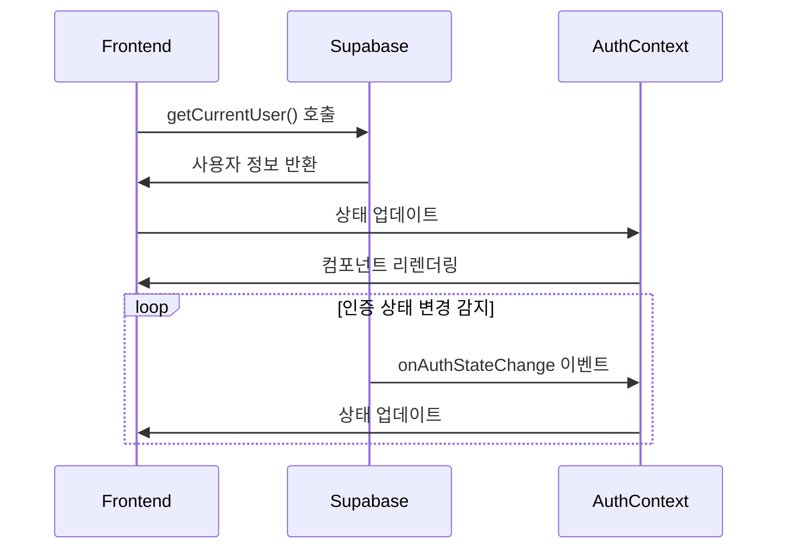

# Code King Builder - 인증 시스템 구조

## 📋 개요

Code King Builder의 인증 시스템은 Supabase를 기반으로 구축되었으며, 클라이언트와 서버 간의 안전한 인증 처리를 위한 구조화된 아키텍처를 제공합니다.

## 🏗️ 인증 시스템 아키텍처

```
┌─────────────────┐    ┌─────────────────┐    ┌─────────────────┐
│   Frontend      │    │   Supabase      │    │   Backend       │
│   Components    │◄──►│   Auth Service  │◄──►│   API Routes    │
└─────────────────┘    └─────────────────┘    └─────────────────┘
         │                       │                       │
         ▼                       ▼                       ▼
┌─────────────────┐    ┌─────────────────┐    ┌─────────────────┐
│  AuthContext    │    │  Email Service  │    │  Middleware     │
│  (React Context)│    │  (Templates)    │    │  (Route Guard)  │
└─────────────────┘    └─────────────────┘    └─────────────────┘
```

## 📁 파일 구조

```
src/
├── lib/
│   └── supabase/
│       ├── client.ts          # Supabase 클라이언트 설정
│       └── api/
│           └── auth.ts        # 인증 관련 API 함수들
├── app/
│   ├── contexts/
│   │   └── AuthContext.tsx    # React Context Provider
│   ├── types/
│   │   ├── Auth.ts           # 인증 관련 타입 정의
│   │   └── IUser.ts          # 사용자 인터페이스
│   └── auth/
│       └── callback/
│           └── page.tsx       # 인증 콜백 처리
└── components/
    └── auth/
        ├── LoginModal.tsx     # 로그인 모달
        └── SignUpModal.tsx    # 회원가입 모달
```

## 🔧 핵심 파일 상세 분석

### 1. `src/lib/supabase/client.ts`

**역할**: Supabase 클라이언트 인스턴스 생성 및 설정

```typescript
import { createClient } from "@supabase/supabase-js";

const supabaseUrl = process.env.NEXT_PUBLIC_SUPABASE_URL!;
const supabaseAnonKey = process.env.NEXT_PUBLIC_SUPABASE_ANON_KEY!;

export const supabaseClient = createClient(supabaseUrl, supabaseAnonKey);
```

**주요 특징**:

- ✅ **환경 변수 기반 설정**: 보안을 위한 환경 변수 사용
- ✅ **타입 안전성**: TypeScript로 타입 보장
- ✅ **싱글톤 패턴**: 애플리케이션 전체에서 하나의 인스턴스 사용

**환경 변수**:

```env
NEXT_PUBLIC_SUPABASE_URL=your_supabase_project_url
NEXT_PUBLIC_SUPABASE_ANON_KEY=your_supabase_anon_key
```

### 2. `src/lib/supabase/api/auth.ts`

**역할**: 인증 관련 API 함수들을 중앙화하여 관리

```typescript
const auth = {
  // 로그인
  async signIn({ email, password }: SignInData) {
    const { data, error } = await supabaseClient.auth.signInWithPassword({
      email,
      password,
    });
    return { data, error };
  },

  // 회원가입
  async signUp({ email, password, name, phone, phoneCountry }: SignupData) {
    const { data, error } = await supabaseClient.auth.signUp({
      email,
      password,
      options: {
        data: {
          name,
          phone,
          phoneCountry,
        },
        emailRedirectTo: process.env.NEXT_PUBLIC_AUTH_CALLBACK_URL,
      },
    });
    return { data, error };
  },

  // 로그아웃
  async signOut() {
    const { error } = await supabaseClient.auth.signOut();
    return { error };
  },

  // 현재 사용자 가져오기
  async getCurrentUser() {
    const {
      data: { user },
      error,
    } = await supabaseClient.auth.getUser();
    return { user: user as IUser, error };
  },

  // 인증 상태 변경 감지
  onAuthStateChange(callback: (event: string, session: any) => void) {
    return supabaseClient.auth.onAuthStateChange(callback);
  },
};
```

**주요 기능**:

- 🔐 **로그인/로그아웃**: 이메일/비밀번호 기반 인증
- 📝 **회원가입**: 사용자 정보와 함께 계정 생성
- 👤 **사용자 정보 조회**: 현재 로그인된 사용자 정보 가져오기
- 🔄 **상태 감지**: 인증 상태 변경 실시간 감지

### 3. `src/app/contexts/AuthContext.tsx`

**역할**: React Context를 통한 전역 인증 상태 관리

```typescript
export const AuthProvider: React.FC<{ children: React.ReactNode }> = ({
  children,
}) => {
  const [user, setUser] = useState<IUser | null>(null);
  const [loading, setLoading] = useState(true);

  useEffect(() => {
    // 초기 사용자 상태 확인
    const checkUser = async () => {
      try {
        const { user } = await auth.getCurrentUser();
        setUser(user);
      } catch (error) {
        console.error("Error checking user:", error);
      } finally {
        setLoading(false);
      }
    };

    checkUser();

    // 인증 상태 변경 감지
    const {
      data: { subscription },
    } = auth.onAuthStateChange((event, session) => {
      setUser(session?.user ?? null);
      setLoading(false);
    });

    return () => subscription.unsubscribe();
  }, []);

  const signIn = async (signInUser: SignInData) => {
    const { error } = await auth.signIn(signInUser);
    return { error };
  };

  const signUp = async (signUpUser: SignupData) => {
    const { error } = await auth.signUp(signUpUser);
    return { error };
  };

  const signOut = async () => {
    const { error } = await auth.signOut();
    return { error };
  };

  const value = {
    user,
    loading,
    signIn,
    signUp,
    signOut,
  };

  return <AuthContext.Provider value={value}>{children}</AuthContext.Provider>;
};
```

**주요 특징**:

- 🌐 **전역 상태 관리**: 애플리케이션 전체에서 인증 상태 공유
- 🔄 **실시간 동기화**: 인증 상태 변경 시 자동 업데이트
- ⚡ **성능 최적화**: 불필요한 리렌더링 방지
- 🛡️ **타입 안전성**: TypeScript로 타입 보장

## 🔄 인증 플로우

### 1. 회원가입 플로우



### 2. 로그인 플로우



### 3. 인증 상태 감지 플로우



## 🛡️ 보안 특징

### 1. 환경 변수 관리

- 민감한 정보는 환경 변수로 관리
- 클라이언트 사이드에서 필요한 정보만 `NEXT_PUBLIC_` 접두사 사용

### 2. 토큰 관리

- Supabase가 자동으로 JWT 토큰 관리
- 리프레시 토큰 자동 갱신
- 세션 만료 시 자동 로그아웃

### 3. 이메일 인증

- 이메일 인증을 통한 계정 활성화
- 안전한 인증 링크 생성
- 스팸 방지를 위한 이메일 템플릿 최적화

## 📧 이메일 인증 시스템

### 관련 문서

- [이메일 인증 템플릿](./email-verification-template.md) - 브랜드 디자인이 적용된 이메일 템플릿

### 주요 특징

- 🎨 **브랜드 일관성**: Code King Builder 디자인 적용
- 📱 **반응형 디자인**: 모든 이메일 클라이언트 호환
- 🔒 **보안 강화**: 안전한 인증 링크 생성
- 📊 **사용자 경험**: 명확한 안내 메시지

## 🚀 사용 방법

### 1. 컴포넌트에서 인증 상태 사용

```typescript
import { useAuth } from "@/app/contexts/AuthContext";

function MyComponent() {
  const { user, loading, signIn, signOut } = useAuth();

  if (loading) {
    return <div>로딩 중...</div>;
  }

  return (
    <div>
      {user ? (
        <div>
          <p>안녕하세요, {user.user_metadata?.name}님!</p>
          <button onClick={signOut}>로그아웃</button>
        </div>
      ) : (
        <button onClick={() => signIn({ email, password })}>로그인</button>
      )}
    </div>
  );
}
```

### 2. 보호된 라우트 설정

```typescript
// middleware.ts
import { createMiddlewareClient } from "@supabase/auth-helpers-nextjs";
import { NextResponse } from "next/server";

export async function middleware(req) {
  const res = NextResponse.next();
  const supabase = createMiddlewareClient({ req, res });

  const {
    data: { session },
  } = await supabase.auth.getSession();

  if (!session && req.nextUrl.pathname.startsWith("/protected")) {
    return NextResponse.redirect(new URL("/login", req.url));
  }

  return res;
}
```

## 🔧 설정 및 배포

### 1. 환경 변수 설정

```env
# .env.local
NEXT_PUBLIC_SUPABASE_URL=your_supabase_project_url
NEXT_PUBLIC_SUPABASE_ANON_KEY=your_supabase_anon_key
NEXT_PUBLIC_AUTH_CALLBACK_URL=http://localhost:3000/auth/callback
```

### 2. Supabase 설정

1. **Authentication 설정**

   - 이메일 인증 활성화
   - 이메일 템플릿 커스터마이징
   - 리다이렉트 URL 설정

2. **보안 설정**
   - JWT 시크릿 설정
   - 세션 타임아웃 설정
   - 비밀번호 정책 설정

## 📊 성능 최적화

### 1. 코드 스플리팅

- 인증 관련 코드는 필요할 때만 로드
- 동적 임포트를 통한 지연 로딩

### 2. 캐싱 전략

- 사용자 정보 캐싱
- 불필요한 API 호출 방지

### 3. 에러 처리

- 네트워크 오류 처리
- 사용자 친화적인 에러 메시지

## 🐛 문제 해결

### 1. 일반적인 문제들

**문제**: 인증 상태가 제대로 동기화되지 않음
**해결**: AuthContext의 useEffect 의존성 배열 확인

**문제**: 이메일 인증 링크가 작동하지 않음
**해결**: Supabase 리다이렉트 URL 설정 확인

**문제**: 빌드 시 useSearchParams 오류
**해결**: Suspense boundary로 감싸기

### 2. 디버깅 팁

```typescript
// 개발 환경에서 인증 상태 로깅
useEffect(() => {
  console.log("Current user:", user);
  console.log("Loading state:", loading);
}, [user, loading]);
```

## 📝 변경 이력

| 버전 | 날짜       | 변경사항              |
| ---- | ---------- | --------------------- |
| 1.0  | 2025-01-XX | 초기 인증 시스템 구축 |
| -    | -          | Supabase 통합         |
| -    | -          | 이메일 인증 추가      |
| -    | -          | React Context 구현    |

---

**참고**: 이 인증 시스템은 Supabase의 최신 기능들을 활용하여 구축되었으며, 확장 가능하고 안전한 사용자 인증을 제공합니다.
