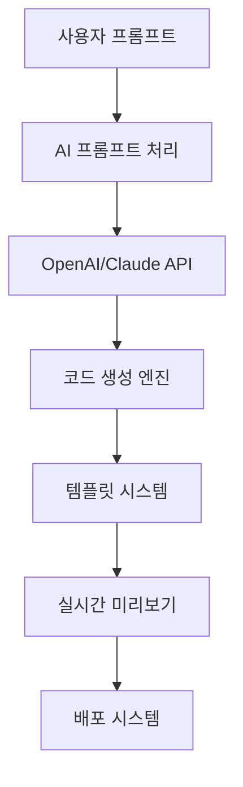

# 📋 Code King Builder 사업계획서 2025

## 📋 개요

### **사업명**

Code King Builder - AI 기반 웹사이트 빌더 SaaS 플랫폼

### **비전**

"누구나 AI와 대화하듯이 전문적인 웹사이트를 만들 수 있는 세상"

### **미션**

- 비개발자도 쉽게 웹사이트를 제작할 수 있는 AI 기반 플랫폼 제공
- 한국 시장에 특화된 로컬 서비스 연동 및 컴플라이언스 대응
- 빠른 MVP 개발부터 엔터프라이즈급 솔루션까지 원스톱 서비스

### **핵심 가치 제안**

1. **AI 대화형 빌더**: 자연어로 웹사이트 제작
2. **한국 특화**: 국내 서비스 연동 및 로컬라이제이션
3. **빠른 배포**: Vercel 연동으로 즉시 배포
4. **전문가 지원**: AI + 개발자 검토로 품질 보장

## 🎯 시장 분석

### **시장 규모**

- **글로벌 웹사이트 빌더 시장**: $2.0-2.1B (2024년) → $2.8-3.9B (2033년)
- **로우코드 플랫폼 시장**: $27.7B (2024년) → $182B (2033년)
- **한국 로우코드 시장**: $545M (2023년) → $2.58B (2030년)

### **타겟 시장**

1. **1-3인 창업자·부티크 에이전시** (MVP, 랜딩페이지)
2. **전통 SMB** (내부툴, 경영 대시보드)
3. **스타트업 비개발 직군** (실험용 마이크로앱)

### **경쟁 우위**

- **한국 로컬화**: 카카오/네이버 로그인, 토스/카카오페이 연동
- **AI 프롬프트 최적화**: 한국어 특화 프롬프트 엔지니어링
- **빠른 배포**: Vercel 연동으로 즉시 배포
- **전문가 지원**: AI + 개발자 검토 시스템

## 🏗️ 기술 아키텍처

### **핵심 기술 스택**

- **Frontend**: Next.js 15, TypeScript, Tailwind CSS
- **AI 서비스**: OpenAI GPT-4, Claude Sonnet
- **인증**: Supabase Authentication
- **배포**: Vercel, Docker
- **데이터베이스**: PostgreSQL (Supabase)

### **AI 빌더 시스템**



### **주요 기능**

1. **AI 대화형 빌더**: 자연어로 웹사이트 요구사항 입력
2. **템플릿 라이브러리**: 업종별 특화 템플릿 제공
3. **실시간 미리보기**: 생성된 웹사이트 즉시 확인
4. **자동 배포**: Vercel 연동으로 원클릭 배포
5. **한국 서비스 연동**: 카카오, 네이버, 토스 등

## 💰 비즈니스 모델

### **수익 구조**

#### **1. 일회성 패키지 (완성형 딜리버리)**

- **STANDARD**: ₩99,000 (100% 마진)
- **DELUXE**: ₩399,000 (100% 마진)
- **PREMIUM**: ₩990,000 (100% 마진)

#### **2. 구독형 SaaS**

- **Starter**: ₩29,000/월 (48% 마진)
- **Professional**: ₩79,000/월 (56% 마진)
- **Enterprise**: ₩199,000/월 (60% 마진)

#### **3. 유지보수 계약**

- **Basic**: ₩99,000/월 (60% 마진)
- **Premium**: ₩199,000/월 (65% 마진)
- **Dedicated**: ₩399,000/월 (62% 마진)

### **수익 예측 (1년차)**

| 수익원            | 고객 수 | 월 수익 | 연 수익 | 비율 |
| ----------------- | ------- | ------- | ------- | ---- |
| **일회성 패키지** | 100명   | ₩8.3M   | ₩100M   | 40%  |
| **구독형 SaaS**   | 200명   | ₩12M    | ₩144M   | 58%  |
| **유지보수**      | 50명    | ₩5M     | ₩60M    | 2%   |
| **총계**          | -       | ₩25.3M  | ₩304M   | 100% |

## 🚀 마케팅 전략

### **타겟 고객별 접근법**

#### **1. 1-3인 창업자·부티크 에이전시**

- **채널**: 인스타그램, 네이버 SA/DA, 카카오톡 채널
- **메시지**: "AI와 대화하듯이 웹사이트 만들기"
- **오퍼**: STANDARD 패키지 20% 할인

#### **2. 전통 SMB**

- **채널**: 업종별 커뮤니티, 지역 비즈니스 네트워크
- **메시지**: "내부툴로 업무 효율성 극대화"
- **오퍼**: Professional 플랜 3개월 무료 체험

#### **3. 스타트업 비개발 직군**

- **채널**: 스타트업 커뮤니티, 개발자 컨퍼런스
- **메시지**: "개발자 없이도 프로토타입 제작"
- **오퍼**: Enterprise 플랜 6개월 할인

### **콘텐츠 마케팅**

- **블로그**: AI 웹 개발 팁, 업종별 사례 연구
- **유튜브**: 튜토리얼, 데모 영상
- **웨비나**: 월간 AI 웹 개발 트렌드 세미나

### **파트너십 전략**

- **에이전시 리셀러**: 20-30% 수수료
- **호스팅 업체**: 제휴 마케팅
- **교육기관**: AI 웹 개발 교육 프로그램

## 👥 조직 구조

### **초기 팀 구성 (1년차)**

```
CEO/Founder (1명)
├── CTO (1명)
│   ├── Frontend 개발자 (2명)
│   ├── Backend 개발자 (2명)
│   └── AI/ML 엔지니어 (1명)
├── CMO (1명)
│   ├── 마케팅 매니저 (1명)
│   ├── 콘텐츠 크리에이터 (1명)
│   └── 고객 성공 매니저 (1명)
└── CFO (1명)
    └── 재무/운영 매니저 (1명)
```

### **성장 계획 (2-3년차)**

- **개발팀**: 15명 (AI, Frontend, Backend, DevOps)
- **마케팅팀**: 8명 (디지털 마케팅, 콘텐츠, 파트너십)
- **고객 성공팀**: 5명 (온보딩, 지원, 교육)
- **운영팀**: 3명 (재무, 인사, 법무)

## 📊 재무 계획

### **초기 투자 필요액**

- **개발 비용**: ₩200M (1년)
- **마케팅 비용**: ₩150M (1년)
- **운영 비용**: ₩100M (1년)
- **총 필요액**: ₩450M

### **수익성 분석**

- **손익분기점**: 18개월
- **3년차 목표 매출**: ₩2B
- **3년차 목표 영업이익**: ₩600M (30% 마진)

### **투자 라운드 계획**

- **시드 라운드**: ₩500M (1년차)
- **시리즈 A**: ₩2B (2년차)
- **시리즈 B**: ₩5B (3년차)

## 🎯 실행 로드맵

### **Phase 1: MVP 개발 및 검증 (1-6개월)**

- **목표**: 핵심 기능 개발 및 초기 사용자 확보
- **주요 활동**:
  - AI 빌더 핵심 기능 개발
  - 템플릿 10개 제작
  - 베타 사용자 50명 모집
  - 피드백 수집 및 개선

### **Phase 2: 제품 완성 및 초기 고객 확보 (6-12개월)**

- **목표**: 제품 완성 및 초기 매출 달성
- **주요 활동**:
  - 템플릿 50개 확대
  - 한국 서비스 연동 완료
  - 유료 고객 100명 확보
  - 월 매출 ₩25M 달성

### **Phase 3: 시장 확장 및 성장 (12-24개월)**

- **목표**: 시장 점유율 확대 및 수익성 달성
- **주요 활동**:
  - 엔터프라이즈 기능 추가
  - 파트너십 확대
  - 해외 시장 진출 준비
  - 월 매출 ₩100M 달성

### **Phase 4: 글로벌 확장 (24-36개월)**

- **목표**: 글로벌 시장 진출 및 IPO 준비
- **주요 활동**:
  - 일본, 동남아시아 진출
  - 고급 AI 기능 도입
  - IPO 준비
  - 월 매출 ₩300M 달성

## ⚠️ 리스크 분석 및 대응

### **기술적 리스크**

- **AI 모델 비용 증가**
  - **대응**: 자체 모델 개발, 비용 최적화
- **기술 변화**
  - **대응**: 지속적인 기술 트렌드 모니터링

### **시장 리스크**

- **기존 강자 진입**
  - **대응**: 한국 특화 기능으로 차별화
- **경기 침체**
  - **대응**: 다양한 가격대 제품 제공

### **운영 리스크**

- **인력 확보 어려움**
  - **대응**: 스톡옵션, 원격근무 등 혜택 제공
- **규제 변화**
  - **대응**: 법무팀 구성, 규제 모니터링

## 📈 성공 지표 (KPI)

### **비즈니스 지표**

- **월간 반복 수익 (MRR)**: 목표 ₩100M (1년차)
- **고객 생애 가치 (LTV)**: 목표 ₩500K
- **고객 획득 비용 (CAC)**: 목표 ₩50K
- **고객 이탈률**: 목표 5% 이하

### **제품 지표**

- **AI 생성 성공률**: 목표 90% 이상
- **평균 응답 시간**: 목표 3초 이하
- **시스템 가동률**: 목표 99.9%
- **사용자 만족도**: 목표 4.5/5.0

### **마케팅 지표**

- **웹사이트 트래픽**: 목표 월 100K 방문자
- **리드 생성**: 목표 월 1,000개
- **전환율**: 목표 3% 이상
- **브랜드 인지도**: 목표 20% (타겟 시장)

## 🔮 미래 비전

### **5년 후 비전**

- **글로벌 AI 웹사이트 빌더 시장 1위**
- **연 매출 ₩50B 달성**
- **전 세계 100만+ 사용자**
- **AI 기술 혁신 선도**

### **장기 목표**

- **AI 기술 라이센싱 사업**
- **교육 및 인증 프로그램**
- **글로벌 개발자 생태계 구축**
- **지속가능한 기술 혁신**

## 📞 연락처

### **사업 문의**

- **이메일**: business@codekingbuilder.com
- **전화**: 02-1234-5678
- **주소**: 서울특별시 강남구 테헤란로 123

### **기술 문의**

- **GitHub**: https://github.com/codekingbuilder
- **문서**: https://docs.codekingbuilder.com
- **지원**: support@codekingbuilder.com

---

**작성일**: 2025년 8월 29일  
**버전**: 1.0.0  
**작성자**: Code King Builder Business Team

---

_이 사업계획서는 시장 상황과 기술 발전에 따라 지속적으로 업데이트됩니다._
